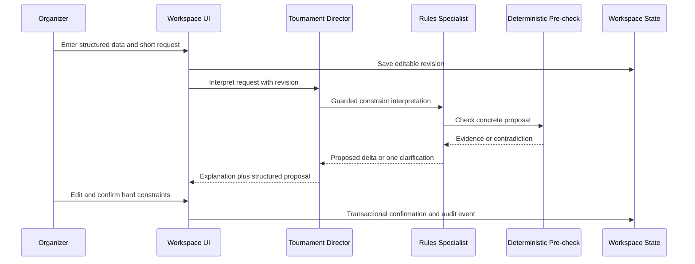
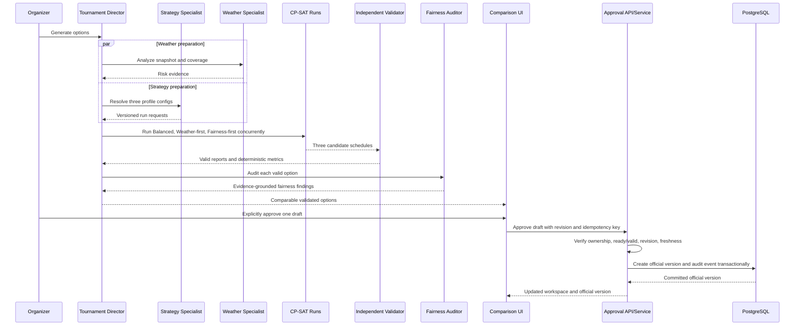
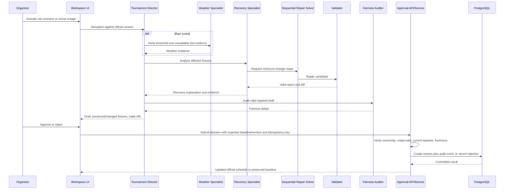

# CrickOps AI — Technical Specification

**Status:** Approved — 2026-07-16

## 1. Purpose and authority

This document defines how the approved requirements in `scope.md` and `prd.md` will be implemented. It is the engineering blueprint for Version 1; it does not authorize implementation. If this document conflicts with the approved scope or PRD, work stops until the conflict is resolved.

## 2. Architecture decisions

### 2.1 Technology baseline

| Layer | Decision | Rationale | Requirements |
|---|---|---|---|
| Web client | Next.js with TypeScript, React, and accessible headless primitives | Strong hosted web workflow, typed contracts, server/client rendering flexibility | UX-001–UX-012, ACCESS-001–ACCESS-006 |
| API | Python FastAPI with Pydantic validation | Aligns deterministic services and Agents SDK in one typed backend | FR-004–FR-035, SEC-003 |
| Agent runtime | OpenAI Agents SDK for Python; `gpt-5.6` primary | Manager-with-specialist-tools orchestration, structured outputs, guardrails, sessions, approvals, tracing | AGENT-001–AGENT-015, OBS-001–OBS-006 |
| Optimization | OR-Tools CP-SAT | Deterministic constraint optimization and repair | SCHED-001–SCHED-030, RECOVERY-001–RECOVERY-009 |
| Weather | Open-Meteo live forecast plus versioned deterministic fixtures | Coordinate-based hourly data and reproducible demo input | WEATHER-001–WEATHER-013 |
| Persistence | PostgreSQL with migrations | Durable guest state, versions, audit, and concurrency | DATA-001–DATA-009, NFR-006–NFR-007 |
| Frontend hosting | Vercel | Approved preferred target | DEPLOY-001–DEPLOY-006 |
| Backend/database hosting | Railway application service plus Railway PostgreSQL | Approved preferred target with persistent managed storage | DEPLOY-001–DEPLOY-007 |
| Observability | Agents SDK tracing plus structured application logs and metrics | Agent evidence plus provider-independent operational diagnosis | OBS-001–OBS-006 |

The architecture remains portable: the web app consumes a versioned HTTP API; the backend uses standard PostgreSQL and environment-based service configuration.

### 2.2 System context

```text
Browser / Next.js
  ├─ organizer workspace UI
  ├─ guest token stored in secure cookie
  └─ same-origin HTTPS /api/v1 (Vercel rewrite/proxy)
          ↓
FastAPI application
  ├─ workspace and approval services
  ├─ agent orchestration service
  ├─ tournament-format service
  ├─ scheduling and repair service
  ├─ independent validator
  ├─ weather and risk service
  ├─ comparison/fairness service
  ├─ audit/export/retention services
  └─ provider health and fallback controller
          ├─ PostgreSQL
          ├─ OpenAI / configured fallback provider
          ├─ Open-Meteo
          └─ trace and log exporters
```

The frontend never calls model or weather providers directly. Every authoritative state transition is performed by the API inside a database transaction and emits an audit event.

### 2.3 Backend modules

```text
app/
  api/             versioned route handlers and response mapping
  domain/          immutable domain types and state-transition rules
  agents/          definitions, prompts, schemas, orchestration, guardrails
  scheduling/      pairing, CP-SAT generation, scoring, repair
  validation/      independent validators and violation reporting
  weather/         live/demo adapters, normalization, risk calculation
  fairness/        deterministic metrics and auditor input preparation
  workspaces/      guest identity, lifecycle, retention, export
  approvals/       draft/official version transitions
  audit/           append-only operational events
  observability/   trace processors, structured logging, metrics
  persistence/     repositories and migrations
```

Domain and deterministic modules do not import agent modules. Agent tools call application services through narrow interfaces.

## 3. Core data contracts

All public and agent-tool contracts use strict, versioned Pydantic models. Unknown fields are rejected for command inputs. Identifiers are UUIDv7; timestamps are timezone-aware UTC ISO 8601 values. Venue-local dates are derived using the stored IANA time zone.

### 3.1 Key application types

| Type | Essential fields |
|---|---|
| `TournamentConfig` | id, name, match_format_preset, allocation_minutes, start_date, end_date, status, time_zone_policy, teams[8], groups[2], venues[2], slots, constraints, priorities, revision |
| `MatchFormatPreset` | code (`T10` or `T20`), operational_allocation_minutes (120 or 240), display_disclaimer, version |
| `Team` | id, display_name, group_id |
| `Venue` | id, display_name, city, country_code, latitude, longitude, iana_time_zone, geocoding_provider, geocoding_reference, confirmed_at |
| `VenueSlot` | id, venue_id, starts_at_utc, ends_at_utc, local_date, availability, source |
| `ConstraintSet` | hard[], soft[], revision, confirmation_state, confirmed_at |
| `Constraint` | id, type, parameters, classification, source, status, explanation |
| `MatchDefinition` | id, stage, sequence, participant_a, participant_b, dependency_ids |
| `ScheduleDraft` | id, tournament_revision, profile, status, placements[15], metrics, validation_report, created_at |
| `ScheduleVersion` | id, version_number, approved_draft_id, approved_at, supersedes_id |
| `FixturePlacement` | match_id, venue_slot_id, starts_at_utc, ends_at_utc |
| `ValidationReport` | valid, validator_version, violations[], checks[], generated_at |
| `ScheduleMetrics` | weather_risk?, weather_coverage, missing_coverage_penalty, group_rest_fairness, potential_knockout_rest, venue_balance, slot_balance, preference_satisfaction, change_cost, soft_violations[] |
| `WeatherSnapshot` | venue_id, mode, issued_at, fetched_at, valid_hours[], quality, provider_metadata |
| `Disruption` | id, type, unavailable_slot_ids, reason, status, created_at |
| `ScheduleDiff` | baseline_version_id, draft_id, unchanged[], moved[], added[], removed[], metric_deltas |
| `AuditEvent` | id, workspace_id, tournament_id, actor_type, event_type, summary, structured_payload, occurred_at |
| `AgentDecisionRecord` | run_id, role, provider, model, input_revision, output_schema_version, tool_evidence_ids, validation_status |
| `WorkspaceFeedback` | target_type, target_id, reason_code, optional_text, consent_scope, created_at |

### 3.2 Constraint classification

Hard constraints are never changed by profile weights. A user request enters `proposed`; it becomes authoritative only after explicit confirmation. Soft constraints carry normalized priority values from 0 to 100 and may be violated at a measured penalty.

Required controlled edits create proposed hard constraints. Preferred edits create soft constraints. Weather thresholds remain soft advice until explicitly confirmed as hard.

## 4. Data persistence design

### 4.1 Relational entities

| Table | Purpose and key relationships |
|---|---|
| `guest_workspaces` | Guest identity hash, mode, created/last_active/expires/deleted timestamps; owns tournaments |
| `tournaments` | One active tournament per workspace; current revision and official version pointer |
| `teams`, `groups`, `venues`, `venue_slots` | Tournament configuration normalized for integrity and querying |
| `constraints` | Versioned hard/soft constraints with confirmation and source |
| `tournament_revisions` | Immutable configuration snapshots used by runs |
| `match_definitions` | Deterministically generated 15-match competition graph |
| `schedule_runs` | Generation/repair request, input revision, profile, status, timing, solver metadata |
| `schedule_drafts` | Candidate schedule, metrics, validation status, baseline version for repair |
| `fixture_placements` | Match-to-slot placement for each draft |
| `schedule_versions` | Approved immutable versions linked to drafts and predecessors |
| `weather_snapshots` | Normalized live or demo forecast inputs with provenance and expiry |
| `disruptions` | Rain/venue events and unavailable slots |
| `schedule_diffs` | Materialized comparison between baseline and candidate |
| `agent_runs` | Role/provider/model/schema/tool/validation provenance; no hidden reasoning |
| `agent_sessions` | Agents SDK SQLAlchemy session records keyed by workspace conversation ID |
| `audit_events` | Append-only organizer-readable operational history |
| `workspace_feedback` | Structured reason and optional text scoped to workspace |
| `feedback_consents` | Optional product-improvement consent receipt and revocation state |
| `idempotency_keys` | Workspace-scoped mutation deduplication |

Database constraints enforce one active tournament per workspace, unique team names per tournament after normalized comparison, exactly one official-version pointer, and immutable approved versions. Application validation enforces fixed counts before confirmation because multi-row cardinality rules do not belong solely in database constraints.

### 4.2 State machines

Tournament:

```text
draft_setup → awaiting_constraint_confirmation → ready_to_schedule
→ options_ready → official_schedule → recovery_draft → official_schedule
```

Schedule draft:

```text
queued → solving → validating → ready
                      └→ invalid
       └→ infeasible | failed | cancelled
ready → approved | rejected | superseded
```

Disruption:

```text
reported → analyzed → repair_ready → approved
                      └→ rejected | infeasible
```

No transition to `ready` is allowed without a valid independent report. No transition to `approved` is allowed without an explicit approval command tied to the expected draft and tournament revision.

### 4.3 Retention and deletion

- A guest workspace expires after **7 consecutive days of inactivity**.
- Each authenticated workspace request advances `last_active_at` and `expires_at`; health checks and background jobs do not.
- A scheduled cleanup job runs at least daily, marks expired workspaces deleted, then hard-deletes their workspace-owned data within 24 hours.
- `Delete workspace` performs immediate logical deletion and queues hard deletion within 15 minutes.
- `Reset demo` deletes tournament-owned data but retains the guest workspace and starts a selected sample or blank tournament.
- Audit logs outside the workspace do not retain raw organizer content after workspace deletion; operational security logs retain only pseudonymous identifiers and minimal metadata for 30 days.
- Optional anonymized product-improvement feedback is disabled by default. If enabled with explicit consent, it is separated from workspace identity, retained for 180 days, and includes a consent receipt and revocation token.

These values satisfy FR-032, SEC-006–SEC-009, DATA-008–DATA-009, and NFR-012.

## 5. Deterministic services

### 5.1 Tournament format generator

`generate_match_graph(config)` verifies eight teams and group cardinality, generates all six unordered pairings per group, and adds:

- SF1: Group A Winner vs Group B Runner-up
- SF2: Group B Winner vs Group A Runner-up
- Final: SF1 Winner vs SF2 Winner

Stable match IDs derive from tournament ID, stage, and pairing key so retries are idempotent. The service returns the match dependency graph and never schedules it.

The tournament selects exactly one Version 1 preset. `T10` maps to a 120-minute operational venue allocation block and `T20` to 240 minutes. The block includes expected play, normal intervals, setup, and operational turnover and is never described as a guaranteed match duration. Every fixture in one tournament uses the same preset; individual duration overrides are rejected.

Requirements: SCHED-001–SCHED-004, SCHED-022–SCHED-025, AC-001, AC-022–AC-023.

### 5.2 Pre-solver feasibility checks

Cheap deterministic checks run before CP-SAT:

- fixed tournament cardinalities and date range;
- supported tournament-wide match-format preset and its fixed operational allocation block;
- 15 distinct usable venue slots;
- valid venue-local time-zone conversion;
- blackout removal and slot duration;
- obvious per-team daily capacity and minimum-rest bounds;
- stage chronology capacity;
- required pins referencing existing matches and slots;
- contradictory required pins/exclusions.

Failures return typed evidence and remedy candidates. Passing these checks does not prove feasibility; CP-SAT remains authoritative.

### 5.3 Independent validator

The validator is separately implemented from model construction. It receives only immutable match definitions, confirmed constraints, venue-availability intervals, slots, and placements. It checks every hard rule, recalculates metrics from raw placements, detects fabricated or missing matches, and emits a deterministic `ValidationReport` containing a canonical input digest, placement digest, validator version, checks, violations, and generated timestamp. It independently rejects partial same-venue overlaps, identical intervals represented by different slot IDs, and any fixture whose complete allocation block falls outside venue availability. No cryptographic signing or key-management system is introduced.

The API refuses to persist a ready draft if `valid=false`. Agent output cannot override it.

Requirements: FR-011, SCHED-009, AC-003, METRIC-001.

### 5.4 Metrics and comparison

Metrics are deterministic and normalized to 0–100, where higher is better except `weather_risk` and `change_cost`, where lower is better. Each metric also exposes raw components.

- Rest fairness: distribution of each team’s minimum and average recovery hours, penalizing spread and low tails.
- Venue balance: deviation of team appearances per venue from the most even attainable distribution.
- Slot balance: deviation of morning/day/evening allocation across teams.
- Preference satisfaction: weighted satisfied preference points divided by possible points.
- Weather risk: mean of known fixture risk values; null when no fixture has usable coverage.
- Weather coverage: percentage of scheduled fixtures with usable forecast data, reported independently from risk.
- Change cost: weighted count and magnitude of moves from the official baseline.

No LLM calculates these values. Profile comparison uses the same metric version and input weather snapshot.

## 6. CP-SAT scheduling model

### 6.1 Sets and parameters

- Matches `M` (15), group matches `G` (12), semifinals `S` (2), final `F` (1).
- Venue slots `K`, each with venue, UTC interval, venue-local date, and local slot category.
- Teams `T` (8), venues `V` (2).
- `eligible[m,k]` after blackouts, thresholds, pins, and stage capacity checks.
- Tournament-wide operational allocation duration and rest parameters in minutes.
- Weather and preference penalties per match-slot.

### 6.2 Decision variables

- `x[m,k] ∈ {0,1}`: match `m` is placed in slot `k`.
- `start[m]`: selected slot start expressed as integer UTC minutes.
- `end[m]`: selected slot start plus the tournament preset’s operational allocation minutes.
- Auxiliary booleans for team/day use, venue allocation, slot categories, preference satisfaction, and repair changes.

### 6.3 Hard constraints

1. **Exactly one slot per match:** `Σk x[m,k] = 1`.
2. **At most one match per venue slot:** `Σm x[m,k] ≤ 1`.
3. **Eligibility:** `x[m,k] = 0` for unavailable, blackout, threshold-blocked, excluded, or incompatible slots.
4. **No team overlap:** no two group matches involving the same known team may overlap.
5. **One match per team per venue-local calendar day:** for every known team and local date, placements across both venues sum to at most one. For knockout placeholders, the conservative participant set is the set of teams that can occupy that placeholder; chronology plus rest rules are enforced across possible qualifiers. The local date is evaluated using the scheduled venue’s IANA time zone.
6. **Minimum rest:** for every pair of matches a team can consecutively play, the later start minus earlier end meets the confirmed minimum.
7. **Complete group stage before semifinals:** each semifinal start is after the maximum end of all 12 group matches.
8. **Complete semifinals before final:** final start is after both semifinal ends and satisfies qualifier rest.
9. **Required pins and edits:** confirmed hard placement requirements are exact or restricted-domain constraints.
10. **Fixed competition graph:** no match may be omitted, duplicated, or invented.
11. **Uniform preset allocation:** every placement uses the tournament-wide 120-minute T10 or 240-minute T20 operational block; a candidate slot is eligible only when the full block fits without venue conflict.
12. **Single tournament timezone:** both venues must have the same confirmed IANA timezone; all local-day constraints and display derivations use it.
13. **Per-venue interval non-overlap:** each candidate placement creates an optional interval variable with fixed preset duration, present when selected. `AddNoOverlap` applies to all optional intervals at each venue. Precomputed conflict constraints are a mathematically equivalent fallback, but one-slot-ID capacity alone is insufficient. Every selected interval must be contained within its venue availability window.
14. **Qualification-role exclusivity:** A1 and A2 are distinct qualifier roles occupied by different Group A teams; B1 and B2 are distinct roles occupied by different Group B teams. A team cannot occupy both semifinals. Hard rest is enforced for every feasible group-stage-to-role path, and final rest is enforced through either semifinal-winner path. Placeholder modeling must not treat every team as simultaneously occupying both roles.

Constraint 5 deliberately prohibits two same-local-day matches even when their intervals do not overlap, satisfying SCHED-020 and AC-021.

### 6.4 Soft objectives

The solver minimizes a weighted integer penalty:

```text
weather_penalty
+ low_rest_and_rest_inequality_penalty
+ venue_imbalance_penalty
+ slot_imbalance_penalty
+ organizer_preference_penalty
+ audience_timing_penalty
+ repair_change_penalty
```

Floating source values are converted to documented bounded integers before modeling. Profile weights are versioned configuration, not code branches:

| Profile | Dominant priorities |
|---|---|
| Balanced | Moderately even weights across weather, rest, venue, slot, and preferences |
| Weather-first | Weather dominates; fairness remains a nonzero safeguard |
| Fairness-first | Rest, venue, and slot equity dominate; weather remains nonzero |
| Custom | Organizer controls mapped to bounded weights; hard rules unchanged |

Exact initial integers are evaluation-tuned and recorded in versioned configuration. Weight changes require regression evaluation because they affect product behavior.

### 6.5 Alternative generation

Each profile is solved independently against one immutable tournament revision and one weather snapshot. Runs may execute concurrently with bounded worker concurrency. Each result is independently validated, scored by the same metric implementation, and persisted only if valid.

If profile solutions are identical, the UI states this rather than manufacturing difference. Optional solution-diversity penalties may be applied only after preserving each profile’s primary objective within an approved tolerance.

### 6.6 Infeasibility evidence

The system combines pre-check findings, assumption literals for user-confirmed constraint groups, and controlled relaxation analysis. It does not expose raw solver internals to organizers. Remedy impact estimates run as separate, labelled what-if checks and never mutate confirmed constraints.

### 6.7 Repair objective

Repair fixes or strongly protects unaffected official placements and uses sequential CP-SAT passes under one total deadline:

1. Build the hard-feasible repair model; any hard violation makes the run infeasible.
2. Minimize the number of changed fixtures, record optimum `C*`, then add `changed_count = C*`.
3. Minimize movement cost, record optimum `M*`, then add `movement_cost = M*`. Movement cost is absolute start-time shift in minutes plus 1,440 minutes for each venue change.
4. Minimize quality degradation across weather coverage/risk, rest, venue, slot, and preference penalties.

The default 15-second repair budget allocates up to 40% to pass 2, 35% to pass 3, and 25% to pass 4. Unused time carries forward. A timeout after a proven earlier optimum may return the best fully validated solution from the current pass with its optimization status; it may never weaken fixed earlier optima.

An unavailable official slot cannot be preserved. Required organizer edits and confirmed thresholds are applied before repair. The result is compared with the immutable official baseline and requires approval.

## 7. Weather model

### 7.1 Live mode

For each venue, request hourly data by latitude, longitude, the shared tournament IANA time zone, and the needed forecast horizon. Normalize at least:

- precipitation probability and precipitation amount;
- temperature and apparent temperature;
- wind speed and gusts;
- weather code;
- forecast issue/fetch time and coverage.

Open-Meteo’s standard forecast horizon may not cover every date in a 21-day tournament window. Matches outside available coverage are marked `forecast_not_yet_available`; their `weather_risk` remains null, they contribute a separately configured missing-coverage penalty to optimization, and they are rescored when coverage becomes available. A schedule exposes `weather_coverage = covered_fixture_count / 15 × 100`, rounded to one decimal. Weather-first comparisons always show coverage beside risk and warn when coverage is below 100%.

### 7.2 Deterministic demo mode

Versioned JSON fixtures contain normalized hourly values, venue coordinates, time zones, issued time, and expected risk outputs. The hero scenario includes a forecast update that crosses a confirmed rain threshold and makes one official slot unavailable.

### 7.3 Fixture risk calculation

Risk uses the selected preset’s operational venue allocation interval plus a configurable lead/lag buffer. Each normalized component is 0–100:

```text
rain = max(precipitation_probability, scaled_precipitation_amount)
heat = threshold curve over apparent_temperature
cold = inverse threshold curve under configured minimum
wind = threshold curve over max(wind_speed, gust_factor)
condition = mapped weather-code severity
fixture_risk = weighted_max_plus_mean(rain, heat, cold, wind, condition)
```

The API returns the total, components, thresholds, quality, and provenance. Default risk remains soft. Confirmed thresholds are evaluated separately and produce explicit slot-unavailability facts.

### 7.4 Cache and failure behavior

- Cache key: rounded coordinates, time zone, requested variables, forecast window, provider/model version.
- Freshness target: 30 minutes for upcoming fixtures; stale data may be shown for up to 6 hours with a visible stale label.
- Provider failure returns last-known data only with timestamp and stale status, otherwise `unavailable`.
- Deterministic mode is selectable and automatically offered, never silently substituted for live mode.

### 7.5 Venue geocoding and attribution

The organizer enters the venue display name separately, then searches Open-Meteo’s location API using city/country or postal-code text; Version 1 does not claim cricket-ground discovery. The API returns bounded location candidates with name, administrative region, country, coordinates, and IANA timezone. The organizer must explicitly select or confirm a candidate. Manual latitude/longitude entry remains available; location validation still derives and confirms the IANA timezone. The second venue cannot be confirmed if its timezone differs from the first.

The UI weather panel and footer display “Weather data by Open-Meteo” with a provider link. Exports include provider name, forecast issue/fetch time, and attribution. The README documents attribution and states that commercial post-hackathon deployment must review the provider’s current paid/self-hosted terms.

## 8. Agent architecture

### 8.1 Orchestration pattern

The Tournament Director is the single user-facing manager. Specialists are exposed as callable specialist tools so the Director retains conversation ownership. Each specialist tool is an application-owned `function_tool` wrapper that validates its structured input, runs the bounded specialist agent, validates the structured result, and returns only the approved schema. This preserves the agents-as-tools manager pattern while ensuring SDK tool guardrails can wrap every specialist call. Code-controlled orchestration starts deterministic work, runs independent profile generation/weather preparation concurrently, and invokes specialists only when their role is relevant.

Every agent has:

- strict structured output;
- immutable workspace/tournament context with revision ID;
- only role-specific read or command tools;
- input/output/tool guardrails;
- a maximum-turn and timeout budget;
- provider/model provenance and trace correlation;
- no direct database, solver-model, or approval-state access.

### 8.2 Shared agent guardrails

Input guardrails reject cross-workspace identifiers, unsupported formats, unsafe schema sizes, and attempts to override confirmed hard constraints. SDK input/output tool guardrails wrap application `function_tool` calls and validate arguments, workspace ownership, tournament revision, role authorization, and returned evidence. Specialist agents are invoked inside those guarded wrappers rather than relying on `Agent.as_tool()` to provide tool guardrails, because the SDK does not currently expose that guardrail pipeline directly on `Agent.as_tool()`. Agent output schemas use `output_type`; application validation then prohibits unsupported claims, fabricated metrics, hidden-reasoning requests, and ungrounded schedule recommendations. Final-agent output guardrails provide an additional user-facing safety layer but are not the only validation boundary.

Agent output is advisory until accepted by deterministic services or organizer approval. A schema-valid fallback-provider response receives exactly the same guardrails and deterministic checks; semantic recommendations may differ.

### 8.3 Specialist definitions

#### Tournament Director

- Objective: move the organizer through setup, comparison, approval, and recovery coherently.
- Input: `DirectorTurnInput(workspace_summary, tournament_revision, user_message, pending_actions, mode)`.
- Output: `DirectorTurnOutput(message, proposed_state_changes[], specialist_requests[], evidence_refs[], ui_actions[])`.
- Tools: read workspace summary; call five specialists as tools; request constraint proposal; start generation; read comparisons; create disruption analysis; request approval UI action.
- Allowed: decide which relevant specialist to call; synthesize evidence; recommend a validated option.
- Prohibited: create fixtures, calculate metrics, confirm hard constraints, approve schedules, or claim unavailable capability.
- Escalate: ambiguity affecting a hard constraint, no valid result, provider degradation, or requested out-of-scope action.

#### Rules and Constraint Specialist

- Objective: convert organizer language into an explicit proposed constraint delta.
- Input: `ConstraintInterpretationInput(current_constraints, user_text, tournament_context)`.
- Output: `ConstraintInterpretationOutput(proposed_additions[], proposed_changes[], ambiguities[], contradictions[], clarification_question?)`.
- Tools: fixed-format rules lookup; deterministic constraint pre-check; venue/time-zone lookup result reader.
- Allowed: propose classifications and one clarification question.
- Prohibited: confirm constraints, silently relax rules, schedule matches, or invent teams/slots.
- Escalate: ambiguous required/preferred intent, conflicting pins, unsupported format, or unresolved venue location.

#### Scheduling Strategy Specialist

- Objective: map organizer priorities to versioned preset/custom weight requests and explain option-level trade-offs.
- Input: `StrategyInput(confirmed_constraints, priorities, available_profiles, validated_metrics?)`.
- Output: `StrategyOutput(profile_requests[], comparison_commentary?, recommendation?, evidence_refs[])`.
- Tools: profile catalog; start deterministic generation; fetch validated comparison.
- Allowed: select profile configuration and recommend using validated metrics.
- Prohibited: create fixtures, edit weights outside bounds, change hard constraints, or rank before metrics exist.
- Escalate: conflicting priorities, no validated alternatives, or requested unsupported travel optimization.

#### Weather Intelligence Specialist

- Objective: explain normalized weather risk, uncertainty, and threshold-driven disruption.
- Input: `WeatherAnalysisInput(venue_snapshots, fixture_risks, thresholds, mode)`.
- Output: `WeatherAnalysisOutput(high_risk_fixtures[], uncertainty_notes[], threshold_events[], alternatives[], evidence_refs[])`.
- Tools: fetch/refresh weather; calculate deterministic risk; compare fixture-slot risks.
- Allowed: recommend avoidance or threshold review.
- Prohibited: calculate risk itself, declare official safety, convert soft risk to hard, or claim radar nowcasting.
- Escalate: unavailable/stale data, severe flag, threshold crossing, or venue mismatch.

#### Fairness and Logistics Auditor

- Objective: independently interpret deterministic fairness metrics and identify material team-treatment outliers.
- Input: `FairnessAuditInput(schedule_id, validation_report, fairness_metrics, team_breakdown)`.
- Output: `FairnessAuditOutput(findings[], outliers[], tradeoffs[], evidence_refs[], overall_summary)`.
- Tools: read validated metrics and fixture breakdown only.
- Allowed: compare and explain valid schedules.
- Prohibited: alter fixtures, override validation, invent fairness values, or call the solver.
- Escalate: invalid schedule, missing metrics, or metric-version mismatch.

#### Disruption and Recovery Specialist

- Objective: translate a rain/venue event into recovery analysis and explain minimum-change drafts.
- Input: `RecoveryInput(official_version, disruption, confirmed_constraints, validated_repairs?)`.
- Output: `RecoveryOutput(affected_fixture_ids[], repair_request?, option_explanations[], recommendation?, evidence_refs[])`.
- Tools: analyze affected slots; start deterministic repair; fetch validated diff and metrics.
- Allowed: recommend a validated draft and explain sacrifices.
- Prohibited: mutate official versions, relax hard constraints, create repairs directly, or approve.
- Escalate: no official schedule, unsupported disruption, infeasible repair, or hard-rule conflict.

### 8.4 Meaningful invocation rule

The orchestration layer records an invocation reason and consumed output references. A specialist is invoked only if its input is available and its role-specific output is needed. The hero flow naturally uses all six roles; tests fail if a call has no consumed role-specific evidence or merely paraphrases an existing result.

### 8.5 Provider abstraction and fallback

`AgentModelProvider` exposes capability discovery and a standard run interface. Configuration selects primary and fallback model IDs. Startup and periodic health checks verify tool calling, strict structured output, timeout behavior, and context limits using non-mutating probes.

Fallback sequence:

1. Primary call with bounded timeout and at most two retry attempts for transient failures.
2. Circuit opens after a configured failure threshold; compatible fallback provider is attempted.
3. Schema validation, role guardrails, deterministic checks, and approval rules are unchanged.
4. If no capable provider is healthy, the request returns deterministic-mode capability flags.
5. Half-open probes restore the primary provider automatically after successful checks.

The fallback provider may recommend differently. It must return the same application schema and cannot weaken hard-rule, validation, or approval guarantees.

### 8.6 Sessions and workspace memory

The Director uses the Agents SDK `SQLAlchemySession` against the existing PostgreSQL database, keyed by an opaque workspace conversation ID. The session stores conversational items and tool activity across runs; it is not the authoritative store for constraints, schedules, approvals, or audit events. Each turn injects a compact, revisioned domain summary from application state so stale conversation history cannot override current confirmed data.

Session rows follow workspace retention and deletion. A resumed run uses the same session. Sessions are not combined with OpenAI server-managed conversation continuation identifiers in the same run.

### 8.7 Human approval

Schedule approval remains an application command, not a model tool side effect. Agents may return an `ui_action` asking the frontend to display an approval dialog. The backend approval endpoint verifies guest ownership, expected tournament revision, ready/valid draft status, and idempotency before transactionally creating an official version and audit event.

Agents SDK human-in-the-loop interruption support may gate future sensitive external tools; it does not replace the explicit Version 1 domain approval endpoint.

### 8.8 Agent instruction contracts

Every agent prompt begins with this source-of-truth hierarchy, highest authority first:

1. Current confirmed application state, official schedule version, and deterministic validation/tool results.
2. Approved product rules and the active versioned optimization configuration.
3. Current workspace preferences and structured feedback.
4. Organizer conversation for intent and explanation.
5. General model knowledge, which may explain concepts but may not supply tournament facts or metrics.

Conflicts are resolved upward. Agents must say “I do not have enough validated evidence to determine that” when required evidence is absent. Forecast uncertainty uses “forecast-based risk” and states coverage/issue time. No agent may invent a fixture, metric, validation result, provider state, approval, or hard constraint. A clarification is required whenever ambiguity could alter a hard constraint, official version, venue location/timezone, match preset, or required-versus-preferred classification.

| Role | Required sequence | Max turns | Output budget | Required escalation |
|---|---|---:|---:|---|
| Director | Read current revision → identify needed role/tool → call only relevant guarded tools → verify evidence refs → respond or request explicit UI approval | 8 | 900 tokens | Ambiguous hard decision, stale revision, no valid option, degraded capability |
| Rules specialist | Read current constraints → parse delta → run pre-check when concrete → return proposal/one clarification | 4 | 600 tokens | Missing required field, contradiction, unsupported format/location |
| Strategy specialist | Read confirmed priorities → load profile config → request generation if needed → read validated comparison → explain/recommend | 4 | 600 tokens | No validated comparable options or metric-version mismatch |
| Weather specialist | Read normalized snapshot/coverage → call risk comparison → check thresholds → explain risk and uncertainty | 4 | 600 tokens | Missing/stale coverage, severe flag, confirmed threshold crossing |
| Fairness auditor | Verify valid report → read deterministic breakdown → identify material outliers → explain separately for group/potential knockout | 3 | 500 tokens | Invalid schedule, absent metric, mismatched config version |
| Recovery specialist | Read official baseline → validate disruption → request repair → read valid diff/metrics → explain/recommend draft | 5 | 700 tokens | No official baseline, unsupported event, stale baseline, infeasible repair |

Tool-use rules:

- A tool is called only when its result is needed; previously valid evidence for the same immutable revision is reused.
- A specialist cannot call another specialist. The Director or code orchestrator owns composition.
- Deterministic tool failures are returned as typed failures, not rewritten as success.
- An agent stops when its structured output is complete; it does not spend remaining turns polishing prose.
- Output exceeding the budget is rejected and retried once with a compact-output instruction; a second failure becomes `insufficient_evidence_or_capacity`.

| Role | Acceptable output example | Unacceptable output example |
|---|---|---|
| Director | “All three options are valid. Balanced best matches your stated priorities; select Approve schedule to make it official.” | “I approved Balanced for you.” |
| Rules specialist | “Does ‘must play Friday evening’ mean a required pin or a preferred slot?” | Inventing required/preferred classification without clarification. |
| Strategy specialist | “Weather-first has lower covered-fixture risk (31.2 vs 44.8), but only 73.3% coverage; I cannot call it safer overall.” | “Weather-first is definitely safest” without comparable coverage and metrics. |
| Weather specialist | “The forecast issued at 09:00 UTC crosses your confirmed 70% rain threshold for slot S14; this is forecast guidance, not an official safety decision.” | “The match will be washed out” or a radar-nowcasting claim. |
| Fairness auditor | “Group-stage rest fairness is 82.0; Team C is the low outlier. Potential knockout rest is reported separately.” | Counting every placeholder as an actual appearance for every team. |
| Recovery specialist | “The draft moves two fixtures and preserves thirteen; no valid one-change repair exists under the confirmed constraints.” | Moving an official fixture directly or silently relaxing rest. |

### 8.9 Orchestration sequences

#### Setup and constraint confirmation



#### Three-profile generation and comparison



#### Disruption recovery and approval



Every approval path verifies workspace ownership, expected tournament revision, ready and independently validated draft status, idempotency, non-stale results, and—for repair—the current official baseline. The UI never creates an official version directly.

## 9. API design

All browser routes are same-origin under `/api/v1`. A Vercel external rewrite or equivalent Next.js proxy forwards them to Railway without changing the browser URL. Guest identity uses an opaque high-entropy token in a `__Host-`-prefixed, host-only (no `Domain` attribute), Secure, HttpOnly, SameSite=Lax cookie with `Path=/`. Every workspace response sends `Cache-Control: private, no-store, max-age=0` and `Vary: Cookie`. Vercel configuration sets `x-vercel-enable-rewrite-caching: 0` for `/api/:path*`, because external-rewrite caching may otherwise honor upstream cache headers. Mutation requests require CSRF protection, `Idempotency-Key`, and `If-Match` tournament revision where relevant. Errors use `ProblemDetails {type,title,status,code,detail,field_errors?,correlation_id,retryable}`.

### 9.1 Workspace and samples

| Method and route | Purpose | Request → response | Validation/auth | Principal failures |
|---|---|---|---|---|
| `POST /workspaces` | Create isolated guest workspace | sample_id? → WorkspaceView | No prior auth; rate limited | invalid sample, capacity |
| `GET /workspace` | Restore current workspace | — → WorkspaceView | Guest cookie | expired, deleted |
| `DELETE /workspace` | Delete workspace | confirmation → 202 | Guest cookie, idempotent | mismatch |
| `POST /workspace/reset` | Reset to blank/sample | sample_id? → WorkspaceView | Guest cookie, confirmation | invalid sample |
| `GET /samples` | List sample metadata | — → SampleSummary[] | Public | unavailable |
| `GET /workspace/export` | Assemble and return the small organizer-safe export synchronously | — → export file | Guest cookie | generation failure |

### 9.2 Tournament setup

| Method and route | Purpose | Request → response | Validation/auth | Principal failures |
|---|---|---|---|---|
| `GET /tournament` | Read active tournament | — → TournamentView | Guest owner | none/expired |
| `PUT /tournament` | Replace editable setup fields | TournamentUpdate → TournamentView | Guest owner, If-Match, fixed bounds | 409 revision, 422 invalid |
| `PATCH /tournament` | Apply structured field delta | TournamentPatch → TournamentView | Same | same |
| `GET /locations/search` | Search geocoding candidates | query, language? → LocationCandidate[] | Guest owner; bounded query | unavailable, no matches |
| `POST /venues/{id}/confirm-location` | Confirm searched or manual coordinates and timezone | candidate_ref or coordinates → VenueView | Guest owner; coordinate/timezone validation; shared-timezone rule | ambiguous, timezone mismatch |
| `POST /tournament/interpret` | Interpret natural language | message → AgentTurnView | Guest owner, provider health | clarification, degraded |
| `POST /constraints/propose` | Add structured proposed change | ConstraintProposal → ConstraintSetView | Guest owner | contradiction |
| `POST /constraints/confirm` | Confirm selected proposed hard constraints | ids, expected_revision → ConstraintSetView | Explicit action, owner | infeasible warning, revision |
| `POST /constraints/reject` | Reject proposals with feedback | ids, reason? → ConstraintSetView | Guest owner | revision |
| `POST /tournament/precheck` | Run deterministic readiness checks | expected_revision → FeasibilityReport | Guest owner | invalid/incomplete |

### 9.3 Weather

| Method and route | Purpose | Request → response | Validation/auth | Principal failures |
|---|---|---|---|---|
| `POST /weather/refresh` | Refresh venue forecasts | venue_ids?, mode → WeatherStatus | Guest owner; coordinate bounds | provider/stale |
| `GET /weather` | Read normalized venue and fixture risk | mode? → WeatherView | Guest owner | unavailable |
| `POST /weather/demo-scenarios/{id}/activate` | Activate deterministic scenario | confirmation → WeatherStatus | Guest owner | invalid scenario |
| `POST /weather/thresholds` | Propose weather threshold | ThresholdProposal → ConstraintView | Guest owner | invalid units/range |

### 9.4 Schedule generation and comparison

| Method and route | Purpose | Request → response | Validation/auth | Principal failures |
|---|---|---|---|---|
| `POST /schedule-runs` | Start three-profile or custom generation | profiles, expected_revision → RunAccepted | Confirmed constraints, owner, idempotent | incomplete, infeasible |
| `GET /schedule-runs/{id}` | Poll/stream-ready status | — → ScheduleRunView | Guest owner | not found |
| `GET /schedule-runs/{id}/events` | Server-sent progress events | — → event stream | Guest owner | disconnected |
| `GET /schedule-drafts/{id}` | Read validated draft | — → ScheduleDraftView | Guest owner | invalid/suppressed |
| `GET /schedule-comparisons` | Compare ready drafts from one run | run_id → ComparisonView | Same revision/metric version | incomplete |
| `POST /schedule-drafts/{id}/feedback` | Record optional structured reason | FeedbackInput → 201 | Guest owner | invalid target |
| `POST /schedule-drafts/{id}/approve` | Set official workspace schedule | expected_revision, confirmation → ScheduleVersionView | Ready+valid, owner, idempotent | stale/invalid |
| `POST /schedule-drafts/{id}/reject` | Reject draft | reason? → 204 | Guest owner | already approved |

### 9.5 Controlled edits and recovery

| Method and route | Purpose | Request → response | Validation/auth | Principal failures |
|---|---|---|---|---|
| `POST /schedule-edits` | Propose move/pin/block | match, placement rule, required/preferred → EditProposal | Official version required | invalid target |
| `POST /schedule-edits/{id}/confirm` | Confirm required edit | expected_revision → ConstraintView | Explicit owner action | conflict |
| `DELETE /schedule-edits/{id}` | Cancel unapproved edit | — → 204 | Guest owner | approved/not found |
| `POST /disruptions` | Report rain/venue unavailability | DisruptionInput → DisruptionView | Official baseline, owner | unsupported |
| `POST /disruptions/{id}/repair-runs` | Start repair | expected_official_version → RunAccepted | Owner, idempotent | infeasible/stale |
| `GET /schedule-diffs/{draft_id}` | Read baseline comparison | — → ScheduleDiffView | Guest owner | incomplete |

Repair approval reuses `POST /schedule-drafts/{id}/approve` and verifies the baseline is still the current official version.

### 9.6 Audit, health, and consent

| Method and route | Purpose | Request → response | Validation/auth | Principal failures |
|---|---|---|---|---|
| `GET /audit-events` | Paginated organizer timeline | cursor, filters → AuditPage | Guest owner | invalid cursor |
| `POST /feedback-consents` | Grant optional anonymized-feedback consent | disclosure_version, accepted → ConsentReceipt | Guest owner | invalid version |
| `DELETE /feedback-consents/{token}` | Revoke optional consent | — → 204 | Revocation token | invalid token |
| `GET /health/live` | Process liveness | — → status | Public, no secrets | 503 |
| `GET /health/ready` | Critical dependency readiness | — → component summary | Public, coarse data | 503 |
| `GET /system/mode` | Current workspace capability mode | — → ModeView | Guest cookie | expired |

## 10. Frontend specification

### 10.1 Design direction

The interface is a **tournament control room**, grounded in fixture cards, match-day bands, and a visible official-schedule spine. It avoids a generic analytics dashboard. The signature element is the **Schedule Rail**: a horizontal/vertical chronological rail that persists across option comparison and repair, making movement and preserved fixtures immediately legible.

Proposed visual tokens for implementation review:

- Pitch ink `#14251C` — primary text and official state.
- Boundary green `#1F6B45` — primary actions and valid state.
- Crease lime `#B8D86A` — selected profile and active rail marker.
- Weather blue `#367C9A` — forecast information.
- Alert amber `#C87924` — risk and trade-offs.
- Pavilion mist `#F2F5EF` — quiet working surface.

Typography: a humanist sans for interface/body, a condensed athletic face used sparingly for match-day headings, and a tabular-number utility face for time and metrics. Exact licensed/system-safe families are selected during implementation without changing the hierarchy.

### 10.2 Application shell and pages

| Route | Purpose and primary content |
|---|---|
| `/` | Sample chooser or create-new entry; concise product boundary and privacy notice |
| `/workspace/setup` | Teams/groups, venues/location, dates/slots, constraints, priorities, Director chat |
| `/workspace/options` | Three-profile comparison, validation badges, metrics, fairness and weather summaries |
| `/workspace/schedule` | Official Schedule Rail, fixture detail, weather, controlled edit entry, versions |
| `/workspace/recovery` | Disruption declaration, repair progress, before/after rail, metric deltas, approval |
| `/workspace/activity` | Human-readable audit timeline and version history |
| `/workspace/settings` | Mode/provider status, export, reset, delete, privacy and feedback consent |

The app is responsive. On desktop, chat is a collapsible right-side Director panel while structured content remains primary. On narrow screens, chat becomes a bottom sheet or separate tab; approvals and schedule content remain accessible without opening chat.

### 10.3 Major components

- `TournamentStepper`: setup readiness and unresolved decisions.
- `DirectorPanel`: conversation, evidence links, clarification, degraded state.
- `ConstraintLedger`: proposed/confirmed, hard/soft, source, edit and confirmation controls.
- `SlotPatternEditor`: calendar-by-venue availability with local time zone.
- `ProfileSelector`: segmented presets plus Custom priorities.
- `ScheduleRail`: chronological fixture placements and stage gates.
- `OptionComparison`: aligned metrics, raw breakdown, soft violations, validation status.
- `WeatherRiskBadge` and `WeatherDetail`: risk, contributors, quality, issue time.
- `FairnessSummary`: team outliers and metric evidence.
- `ScheduleDiffRail`: unchanged/moved/added/removed states; no color-only meaning.
- `ApprovalDialog`: version, validation, effect, explicit action.
- `ModeIndicator`: primary/fallback/deterministic with concise impact.
- `AuditTimeline`: operational events, version links, filters.

### 10.4 Client state

Server state is authoritative and fetched through a typed query cache. Editable setup uses a local draft keyed to the last server revision. Mutations include the revision and idempotency key. A 409 response triggers an explicit refresh/merge decision rather than silent overwrite.

Long-running runs use server-sent events with polling fallback. Navigation does not cancel backend runs; returning to the page resumes status from the run ID.

### 10.5 Loading, empty, and error behavior

- Skeletons preserve page structure; progress stages name interpretation, solving, validation, audit, and comparison.
- Empty states give one primary next action and sample access.
- Infeasible state replaces option cards with evidence and remedy actions.
- Partial weather keeps schedule metrics visible but marks risk coverage incomplete.
- Invalid drafts are never rendered as selectable options.
- Provider failure changes the mode indicator and explains which conversational features are unavailable.
- Reduced-motion preferences disable rail movement animation; diffs remain understandable statically.

## 11. Security architecture

- Guest tokens contain no workspace data, are hashed at rest, rotate after workspace creation/reset as needed, and are scoped by Secure HttpOnly cookies.
- Every repository query requires the resolved workspace ID; service methods never accept an unchecked workspace ID from an agent.
- The browser uses the same-origin `/api/v1` proxy, so browser CORS is unnecessary. Direct cross-origin browser access to Railway is denied; any approved non-browser operational client uses separate server authentication.
- CSRF protection combines SameSite cookies, an anti-CSRF token, and validation of the browser `Origin` against the configured public frontend origins using trusted forwarded-host configuration.
- Workspace API responses are never cached by Vercel or another intermediary.
- Rate limits apply by IP and workspace to creation, agent, weather, solve, and export routes.
- Request bodies, agent outputs, and tool arguments have strict size and schema limits.
- Logs redact cookies, keys, free-text prompts by default, and sensitive trace inclusion is disabled unless explicitly enabled in a controlled development environment.
- Exports omit provider metadata that could expose internal configuration and never include secrets, raw traces, or hidden reasoning.

Requirements: SEC-001–SEC-009, OBS-005, DEPLOY-003.

## 12. Reliability and quality

### 12.1 Retries and circuit breakers

- Retry only transient network, timeout, 429, and provider 5xx errors with exponential backoff and jitter.
- Do not retry validation, authentication, infeasibility, or unsupported-capability failures.
- Model call: 30-second default timeout; at most two retries within the user-visible operation budget.
- Weather call: 10-second timeout; at most two retries, then stale/unavailable behavior.
- Solver run: 20-second per-profile target limit and 15-second repair target limit; return best feasible candidate only if it is fully validated and clearly not claimed optimal.
- Circuit breakers are per dependency and environment; state is exposed through internal metrics and coarse public readiness.

### 12.2 Idempotency and concurrency

All state-changing endpoints accept workspace-scoped idempotency keys. Schedule approval uses a transaction with row locking or optimistic version comparison so two requests cannot create competing official versions. Generation and repair are bound to immutable tournament revisions; stale results are retained for audit but cannot be approved.

### 12.3 Background work

Profile generation, repair, weather refresh, and retention deletion run as resumable jobs. Version 1 export assembly is synchronous because one workspace is small; it is not placed on the background queue. Version 1 may use a PostgreSQL-backed job table to avoid introducing a separate queue dependency; workers claim jobs with `FOR UPDATE SKIP LOCKED`, heartbeat, and bounded retries. This decision is sufficient for the fixed small scale and portable hosting.

### 12.4 Testing strategy

| Layer | Required tests |
|---|---|
| Domain | Cardinality, state transitions, constraint classification, versioning |
| Pairing | Property tests for exactly 12 unique group matches and correct knockout graph |
| Solver | Feasible fixtures, seeded infeasibility, every hard rule, all profiles, determinism of validation |
| Day/chronology | Cross-venue local-day cases, non-overlapping same-day rejection, group-before-semifinal, semifinal-before-final |
| Format presets | T10 120-minute and T20 240-minute allocation, uniform tournament preset, capacity/overlap differences, and no individual-duration override |
| Venue intervals | Optional intervals/NoOverlap, partial overlaps, duplicate intervals under distinct slot IDs, allocation containment within availability |
| Knockout roles | A1/A2 and B1/B2 exclusivity, every possible rest path, final-winner paths, and same-local-day semifinals when feasible |
| Validator | Mutation tests: delete/duplicate/overlap/blackout/rest/day/chronology violations |
| Weather | Golden risk vectors, stale/missing coverage, threshold crossing, time-zone boundaries |
| Repair | One/many unavailable slots, preservation, infeasible repair, stale official baseline |
| Agents | Schema conformance, tool authorization, ungrounded recommendation rejection, meaningful invocation evidence, provider parity protections |
| API | Ownership, CSRF/CORS, idempotency, revision conflicts, error contracts |
| UI | Keyboard journey, screen-reader labels, comparison, approval, diff, degraded states |
| End-to-end | Both samples, both disruptions, primary hero, deterministic mode, concurrent guests, expiration/deletion/export |
| Performance | Directional 10/30/15-second budgets and concurrent judge load |

The validator test suite includes hand-crafted invalid schedules rather than relying only on solver output. Zero hard violations is a release gate.

### 12.5 Evaluation fixtures

Maintain versioned evaluation cases for:

- clean feasible international and Pakistan samples;
- insufficient capacity;
- rest/blackout conflict;
- same-team non-overlapping matches on one local day;
- identical start-time patterns under T10 and T20, verifying different capacity, overlap, weather exposure, rest, and repair outcomes;
- partial and identical same-venue overlaps represented by different slot IDs, plus an allocation block extending beyond availability;
- both semifinals on the same local day when scheduled at nonconflicting venues or intervals with valid rest;
- attempted different-timezone venue confirmation (rejected) and daylight-saving boundaries within the shared timezone;
- chronology pressure near the final day;
- conflicting required pin;
- live weather missing at one venue;
- deterministic threshold-crossing rain;
- venue unavailability;
- provider invalid schema and tool-call failure;
- organizer rejection reason influencing the next recommendation.

### 12.6 Public-demo protection limits

Initial production defaults are configuration, surfaced in metrics, and may be lowered during an incident without changing product semantics:

| Limit | Default |
|---|---:|
| Active long-running generation or repair per workspace | 1 |
| Profile-generation requests per workspace per rolling 24 hours | 12 |
| Repair requests per workspace per rolling 24 hours | 12 |
| Agent model calls per workspace per rolling 24 hours | 80 |
| Agent model calls per IP per rolling 24 hours | 300 |
| Weather refreshes per workspace per rolling 24 hours | 60 |
| Concurrent CP-SAT jobs per worker instance | 4 |
| Queued long-running jobs per workspace | 1 |
| Global daily model-provider budget | USD 50 default, environment-configurable |

At 75% of the global budget, nonessential retries stop and operators are alerted. At 100%, new conversational work enters deterministic mode while existing deterministic scheduling and repair remain available. An operator-controlled emergency switch forces deterministic mode immediately. Rate-limit responses state the reset time and do not destroy state. Abuse logs retain workspace/IP pseudonyms, counters, action type, and timestamp—not raw prompts.

## 13. Observability

Each user-visible operation receives a correlation ID propagated through HTTP, agent trace, tool call, solver run, validator report, weather fetch, database mutation, and audit event.

Metrics include request latency/error rate, job queue depth, solver status/time, validation failures, weather freshness, provider mode/fallback counts, circuit state, agent schema failures, approval conflicts, workspace expiration count, and hero-flow success.

Agents SDK trace export is enabled for the official demo environment with sensitive-data capture disabled. A custom trace processor mirrors minimal span metadata to structured application logs. If OpenAI trace export is unavailable, local logs still retain run, role, provider, tool, validation, and timing evidence.

Organizer audit events remain deliberately separate from developer observability.

## 14. Deployment topology

### 14.1 Production

- Vercel hosts the Next.js frontend.
- Railway hosts one FastAPI web service, one worker service, and one PostgreSQL service in the production environment.
- A Vercel external rewrite proxies browser `/api/v1/:path*` requests to the Railway FastAPI service while preserving the browser’s Vercel origin.
- Frontend public environment variables contain only the API base URL and non-secret build metadata.
- Backend environment variables contain database URL, provider keys/model IDs, allowed origins, cookie and encryption secrets, trace configuration, weather configuration, and retention settings.
- Database migrations run as a release/pre-deploy command with backward-compatible changes.
- `/health/live` checks process health; `/health/ready` checks database and critical configuration without making every optional provider outage take the API offline.
- Railway health checks target readiness for deployment rollout; external dependency degradation changes capability mode rather than causing restart loops.

### 14.2 Environments

- Local: local web/API, isolated development database, deterministic services defaultable.
- Preview: Vercel preview plus an isolated non-production backend and database; preview origins never proxy to or access production guest data.
- Production: restricted origins, production secrets, retention job, tracing, alerting, and sample fixtures.

### 14.3 Portability

The backend ships as a container-compatible ASGI service, uses standard PostgreSQL, serves no local persistent files, and relies on environment configuration. The worker uses the same image with a different entry command.

## 15. Requirement-to-component traceability

| Component | Primary PRD identifiers |
|---|---|
| Guest workspace and retention | FR-001–FR-003, FR-025, FR-031–FR-033, SEC-001, SEC-006–SEC-009, DATA-008–DATA-009 |
| Guided setup and constraints | FR-004–FR-008, FR-020–FR-023, SCHED-005–SCHED-009, APPROVAL-001, APPROVAL-006 |
| Format and pairing engine | SCHED-001–SCHED-004, AC-001 |
| Match-format presets | SCHED-022–SCHED-025, AC-022–AC-023 |
| Venue geocoding | SCHED-028, AC-024 |
| Shared-timezone handling | SCHED-026–SCHED-027, AC-024 |
| CP-SAT generation | FR-009–FR-012, SCHED-010–SCHED-030, NFR-001 |
| Independent validator | FR-011, AGENT-007, SCHED-009, SCHED-029–SCHED-030, AC-003, AC-026–AC-027, METRIC-001–METRIC-003 |
| Weather and risk | WEATHER-001–WEATHER-013, AC-005–AC-007, AC-025 |
| Fairness and comparison | FR-012–FR-013, FAIR-001–FAIR-005, UX-003–UX-005 |
| Approval and versioning | FR-014–FR-015, APPROVAL-002–APPROVAL-007, DATA-003 |
| Controlled edits and repair | FR-016–FR-021, RECOVERY-001–RECOVERY-009, AC-008–AC-010 |
| Agent orchestration | AGENT-001–AGENT-014, OBS-001–OBS-006 |
| Provider fallback | FR-028–FR-030, AGENT-012–AGENT-013, NFR-005, FAIL-007–FAIL-008 |
| Organizer UI | UX-001–UX-012, ACCESS-001–ACCESS-006 |
| Audit and workspace memory | FR-024–FR-027, DATA-001, DATA-005–DATA-007 |
| Deployment and health | DEPLOY-001–DEPLOY-008, NFR-008–NFR-010, NFR-013 |

### 15.1 Complete PRD identifier coverage index

This index prevents silently orphaned identifiers. Detailed ownership remains in the component table and relevant sections above.

| Identifier family | Covered range | Primary specification sections |
|---|---|---|
| User problems | PROB-001–PROB-010 | 2, 15, 16 |
| Personas | PERSONA-001–PERSONA-004 | 2, 8–10 |
| Jobs to be done | JTBD-001–JTBD-007 | 2, 8–10 |
| User journeys | JOURNEY-001–JOURNEY-005 | 2, 8–10 |
| Functional | FR-001–FR-037 | 3–14 |
| Scheduling | SCHED-001–SCHED-030 | 3, 5–7, 9, 12, 17 |
| Weather | WEATHER-001–WEATHER-013 | 7, 9–10, 12, 17 |
| Agents | AGENT-001–AGENT-015 | 8, 12–13 |
| Recovery | RECOVERY-001–RECOVERY-010 | 5–6, 8–10, 12 |
| Fairness | FAIR-001–FAIR-006 | 5, 8, 10, 17 |
| Approval | APPROVAL-001–APPROVAL-008 | 4, 8–11 |
| User experience | UX-001–UX-012 | 9–10 |
| Accessibility | ACCESS-001–ACCESS-006 | 10, 12 |
| Non-functional | NFR-001–NFR-013 | 4, 11–14 |
| Security | SEC-001–SEC-009 | 4, 9, 11–12 |
| Data | DATA-001–DATA-010 | 3–4, 9, 13 |
| Observability | OBS-001–OBS-006 | 8, 13 |
| Failure states | FAIL-001–FAIL-013 | 5–12 |
| Acceptance | AC-001–AC-027 | 5–12, 17 |
| Evaluation metrics | METRIC-001–METRIC-012 | 5, 8, 12–13 |
| Deployment | DEPLOY-001–DEPLOY-008 | 9, 11, 14 |

## 16. Design review

### 16.1 Deliberate scope controls

- One web service plus one worker and PostgreSQL avoids premature microservices.
- PostgreSQL-backed jobs avoid an additional queue system at fixed Version 1 scale.
- One deterministic comparison/metric implementation serves agents and UI.
- Agent approval is not used as domain approval; the explicit transactional endpoint is easier to verify.
- Travel abstractions stop at extensible constraint/metric types; no unused routing integration is built.
- Communications, authentication, scoring, public publishing, and results progression remain absent.
- T10 and T20 share one parameterized single-day model; ODI and multi-day state are not partially implemented.
- One shared tournament timezone avoids unsupported travel and cross-timezone rest semantics.
- The versioned optimization appendix fixes testable initial behavior without creating a user-facing advanced-tuning system.

### 16.2 Risky assumptions requiring early spikes

1. Official documentation identifies `gpt-5.6` as the GPT-5.6 Sol alias and `gpt-5.6-sol` as the concrete model ID. Target-account access, chosen alias-versus-snapshot policy, model settings, structured-output behavior, and tool compatibility must still pass a pre-implementation capability spike.
2. The configured fallback provider must pass tool-calling and strict-schema capability tests; otherwise it is disabled and deterministic mode remains the fallback.
3. Open-Meteo forecast coverage is shorter than the maximum tournament window, so uncovered future fixtures must show unavailable forecast rather than a score.
4. Conservative rest modeling for unresolved knockout participants must be validated against desired organizer expectations.
5. Three concurrent profile solves plus agent work must meet demo latency on Railway’s chosen service size.
6. Anonymous consent revocation must be usable before enabling retained product-improvement feedback.
7. Verify Vercel external rewrites preserve the required `Set-Cookie` behavior and that `x-vercel-enable-rewrite-caching: 0` prevents workspace-response caching in production and previews.
8. Calibrate `optimization-config/v1` against documented evaluation fixtures; the fixed initial values are product defaults, not medical or official safety thresholds.
9. Confirm the hackathon’s use of Open-Meteo is within current evaluation/prototyping terms and includes required attribution; select a commercial or self-hosted plan before commercial use.

### 16.3 Deadline threats

- Custom priorities UI beyond five bounded controls.
- Drag-and-drop fixture editing; implement form-based move/pin/block first.
- Secondary-provider integration before primary agent and deterministic mode are stable.
- Elaborate animation or mobile-specific schedule manipulation.
- Product-improvement feedback retention beyond workspace-scoped feedback.
- ODI, multi-timezone tournaments, or cricket-ground discovery beyond confirmed city/location geocoding.
- Tuning optimization formulas through an administrative UI; Version 1 uses reviewed configuration files and evaluation cases.

These remain required only where the PRD marks them V1; implementation order must place the complete primary hero flow and deterministic safety ahead of optional polish. If the fallback provider threatens the deadline, the document set must be amended with approval rather than silently omitting it.

### 16.4 Hero-demo feasibility conclusion

The hero journey is feasible if development proceeds deterministic-core first: format → validator → solver profiles → repair → weather demo → API/state → six bounded agent roles → comparison/recovery UI → deployment and repeated evaluation. The fixed small format, preloaded setup, deterministic rain data, and explicit degraded mode reduce demonstration risk without faking generation or repair.

## 17. Versioned optimization configuration appendix

The initial configuration is `optimization-config/v1`. It is stored as reviewed data, hashed into every schedule run, and returned with metrics. Changes create a new version and require regression evaluation; they never alter historical results.

### 17.1 Numeric conventions

- `clamp(x,a,b) = min(max(x,a),b)`.
- Piecewise curves interpolate linearly between stated points.
- Display metrics use decimal round-half-up to one decimal place.
- Solver coefficients use `round_half_up(value × 10)` to create integers on 0–1000; no binary floating-point values enter CP-SAT.
- Missing values remain null and are never coerced to zero.

### 17.2 Weather risk configuration

For a fixture allocation block plus a 30-minute lead and 30-minute lag buffer, take the worst hourly value in the interval. Components are 0–100:

| Component | Initial formula |
|---|---|
| Rain | `max(precipitation_probability, clamp(precipitation_mm / 5 × 100, 0, 100))` |
| Heat | 0 at apparent temperature ≤32°C; linear to 100 at ≥45°C |
| Cold | 0 at apparent temperature ≥12°C; linear to 100 at ≤0°C |
| Wind | maximum of sustained-wind curve (0 at ≤25 km/h, 100 at ≥60) and gust curve (0 at ≤35 km/h, 100 at ≥75) |
| Condition | WMO 0–3: 0; 45/48: 20; 51–57: 30; 61/66/80: 50; 63/67/81: 65; 65/82: 80; 71–77/85/86: 70; 95: 90; 96/99: 100; unknown: null |

Known-fixture risk is:

```text
weighted_mean = 0.45·rain + 0.20·heat + 0.10·cold + 0.15·wind + 0.10·condition
fixture_risk = round_half_up(0.60·max(known components) + 0.40·weighted_mean_known)
```

The weighted mean renormalizes over known components. A fixture needs precipitation probability plus at least temperature and wind to count as covered; otherwise risk is null. Schedule `weather_risk` is the mean of known fixture risks. Schedule `weather_coverage` is covered fixtures divided by 15.

Suggested organizer-confirmable hard thresholds are initially: precipitation probability ≥70%, apparent temperature ≥40°C or ≤5°C, sustained wind ≥40 km/h, gust ≥60 km/h, or WMO thunderstorm code in {95, 96, 99}. They are inactive until explicitly confirmed.

For the objective’s weather/coverage component, a covered fixture contributes its calculated risk and an uncovered fixture contributes only the missing-coverage penalty: Balanced 55, Weather-first 70, Fairness-first 45, Custom default 55. The UI continues to show uncovered risk as null.

### 17.3 Profile objective weights

Weights sum to 100 and multiply normalized penalties:

| Profile | Weather/coverage | Rest | Venue balance | Slot balance | Organizer preferences | Audience timing |
|---|---:|---:|---:|---:|---:|---:|
| Balanced | 25 | 25 | 15 | 10 | 20 | 5 |
| Weather-first | 50 | 20 | 10 | 5 | 10 | 5 |
| Fairness-first | 15 | 40 | 20 | 15 | 5 | 5 |

Custom sliders are integers 0–100 and are normalized to sum to 100. All-zero input is rejected. Repair change objectives are handled by sequential passes and do not share these profile weights.

### 17.4 Slot categories and audience timing

Categories use the shared tournament local timezone and fixture start time:

- Morning: 06:00–11:59.
- Day: 12:00–16:59.
- Evening: 17:00–22:59.
- Off-hours: 23:00–05:59; allowed only when supplied by the organizer and receives a default audience penalty of 30 unless explicitly preferred.

Weekend means local Saturday or Sunday. A high-audience match receives satisfaction 100 in an organizer-selected prime slot, 70 in another weekend slot, 40 in another standard slot, and 0 in an off-hours slot. Rivalry labels do not change hard rules.

### 17.5 Rest metrics and knockout uncertainty

For confirmed group-stage fixtures, each team’s rest margin is the minimum interval between consecutive fixture blocks minus the confirmed minimum rest. Convert its nonnegative margin to quality `q_t = clamp(margin_minutes / 1440 × 100, 0, 100)`. Then:

```text
rest_equity = 100 - (max(q_t) - min(q_t))
group_rest_fairness = 0.5·mean(q_t) + 0.5·rest_equity
```

Potential knockout rest is separate. A team may qualify as exactly one of its group’s mutually exclusive roles (A1 xor A2, or B1 xor B2), never both. For each team, evaluate each role it could exclusively occupy and take the worst valid rest interval from that team’s last group fixture to that role’s semifinal. Report the minimum, median, and per-team values; do not count placeholder appearances as actual team matches or simultaneous roles. Final-stage potential rest is the smaller rest interval from either semifinal winner path to the final. Hard rest constraints conservatively protect every feasible path while still permitting both semifinals on the same local day when venue intervals and rest rules allow.

### 17.6 Venue, slot, and preference metrics

- Venue balance uses the 12 confirmed group matches. For each team with three group appearances, `venue_imbalance_t = clamp((abs(v1_count-v2_count)-1)/2 × 100,0,100)`. Score is `100 - mean(imbalance_t)`. Potential knockout venue allocation is displayed separately and does not pretend every team qualifies.
- Slot balance compares each team’s group-stage morning/day/evening proportions with the tournament-wide group-stage proportions. Per-team distance is half the L1 distance; score is `100 - mean(distance_t × 100)`. Off-hours is a fourth category when present.
- Soft preferences have organizer priority 1–100. Exact satisfaction is 100, partial window satisfaction is 50 only when the preference explicitly defines an acceptable wider window, and violation is 0. Preference satisfaction is the priority-weighted mean; penalty is `100 - satisfaction`.
- Soft-violation records retain preference ID, achieved value, penalty, and explanation. Audience timing is calculated separately using Section 17.4.

### 17.7 Comparison rules

All alternatives in one comparison use the same configuration version, tournament revision, match preset, weather snapshot, and rounding rules. Group-stage fairness, potential knockout rest, final-stage rest, weather risk, and weather coverage are separate fields. An option with incomplete weather coverage cannot receive an unqualified “lower weather risk” recommendation; the explanation must state the coverage difference and missing-coverage penalty.

## 18. Source verification

This specification was checked against current primary documentation on 2026-07-15:

- [OpenAI Agents SDK overview](https://openai.github.io/openai-agents-python/)
- [OpenAI model catalog](https://developers.openai.com/api/docs/models)
- [Agents SDK models and non-OpenAI providers](https://openai.github.io/openai-agents-python/models/)
- [Agents SDK agents and structured output types](https://openai.github.io/openai-agents-python/agents/)
- [Agents as tools and tool support](https://openai.github.io/openai-agents-python/tools/)
- [Agents SDK guardrails](https://openai.github.io/openai-agents-python/guardrails/)
- [Agents SDK sessions](https://openai.github.io/openai-agents-python/sessions/)
- [Human-in-the-loop approvals](https://openai.github.io/openai-agents-python/human_in_the_loop/)
- [Agents SDK tracing](https://openai.github.io/openai-agents-python/tracing/)
- [OR-Tools CP-SAT](https://developers.google.com/optimization/cp/cp_solver)
- [Open-Meteo forecast API](https://open-meteo.com/en/docs)
- [Open-Meteo geocoding API](https://open-meteo.com/en/docs/geocoding-api)
- [Open-Meteo pricing and attribution](https://open-meteo.com/en/pricing)
- [Vercel rewrites](https://vercel.com/docs/rewrites)
- [MDN Set-Cookie reference](https://developer.mozilla.org/en-US/docs/Web/HTTP/Headers/Set-Cookie)

Exact package versions and model identifiers will be locked in `checklist.md` only after compatibility spikes confirm them. Official hackathon rules must be checked separately before submission.
